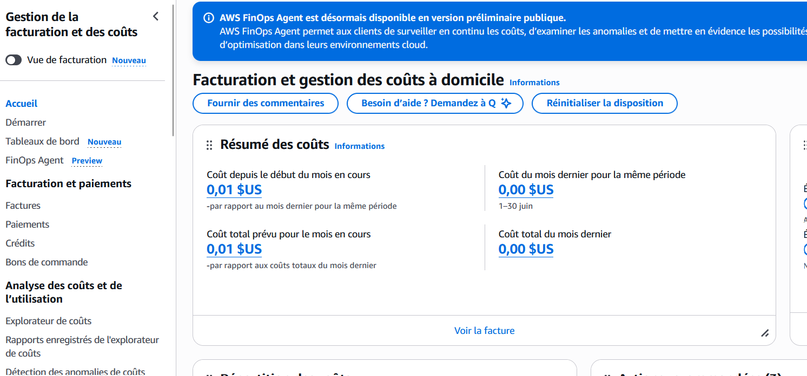
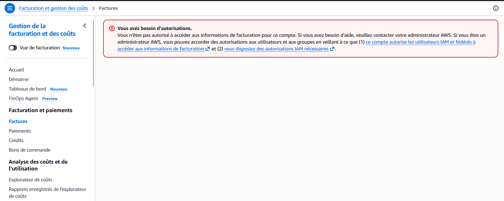
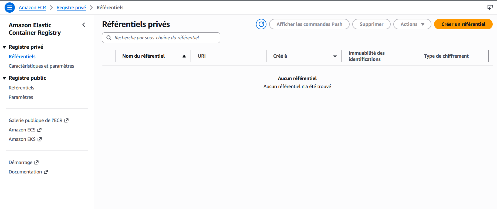

## Question 1 : Analyse du `terraform plan` et détection de dérive (Drift)

### 1. Commande exécutée
```bash
terraform plan
```

### 2. Extrait du retour Terraform
```bash
Note: Objects have changed outside of Terraform

Terraform detected the following changes made outside of Terraform since the last perform:

  # aws_security_group.ecs_sg has been changed
  ~ resource "aws_security_group" "ecs_sg" {
      id   = "sg-0692b76fbee183beb"
      name = "tp2-docker-ecs-sg"
    }

Plan: 0 to add, 1 to change, 0 to destroy.
```

### 3. Interprétation de la détection
* **Ce que Terraform détecte** : Terraform identifie un écart entre l'infrastructure réelle sur AWS et son fichier d'état (`.tfstate`). Il voit qu'une ressource (le Security Group) a été modifiée manuellement hors du code ("outside of Terraform").
* **Ce qu'il propose** : Terraform propose d'appliquer une modification (`1 to change`) pour réinitialiser la ressource et la remettre exactement dans l'état défini dans les fichiers `.tf`.

---

## Question 2 : Inspection du `tfstate` et mesure de sécurité

### 1. Inspection de l'état
Commandes d'inspection exécutées :
```bash
terraform show -json | jq '.values.root_module.resources[].type'
terraform state list
```

### 2. Les trois informations sensibles identifiées dans le `tfstate`

Le fichier `terraform.tfstate` enregistre l'état complet des ressources au format JSON sans chiffrement applicatif natif. Trois informations sensibles y figurent en clair :

1. **Rôles IAM et Identifiants AWS** : L'ARN du rôle IAM utilisé (`arn:aws:iam::883395775398:role/LabRole`) et l'ID du compte AWS (`883395775398`), ce qui expose la cartographie des privilèges du compte.
2. **Topologie Réseau / Interne** : Les identifiants explicites du VPC (`vpc-0fa18b3ec423dc3bb`) et des Subnets (`subnet-0575adab8f85ac3b4`), révélant l'architecture réseau interne.
3. **Jetons d'accès et Variables de Session** : Les clés d'accès temporaires (`AWS_ACCESS_KEY_ID`, `AWS_SECRET_ACCESS_KEY`, `AWS_SESSION_TOKEN`) ainsi que les attributs détaillés de toutes les ressources créées.

---

### 3. Le contrôle qui protège ce fichier dans notre configuration

Dans notre architecture, la sécurité du fichier d'état est assurée par un **Backend distant AWS S3** configuré avec plusieurs niveaux de protection :

* **Chiffrement au repos (*Encryption at rest*)** : Le bucket S3 est configuré avec le chiffrement côté serveur (SSE-S3 / AES-256 ou AWS KMS) pour que les données soient chiffrées sur le disque.
* **Restriction d'accès IAM & Blocage Public** : L'accès au bucket S3 est strictement restreint via les politiques IAM et l'option *Block Public Access* est activée pour empêcher tout accès non autorisé depuis Internet.
* **Verrouillage d'état (*State Locking*)** : L'utilisation combinée avec une table **DynamoDB** garantit l'intégrité des opérations concurrentes.

---

## Question 3 : Tableau des ressources AWS déployées

Ce tableau détaille l'ensemble des ressources AWS écrites et provisionnées dans nos fichiers de configuration Terraform (`.tf`), en précisant le composant Terraform associé, la ressource générée sur AWS et son rôle exact dans l'architecture.

### Tableau récapitulatif des ressources AWS (Terraform)

| Composant / Fonction | Ressource AWS (Code Terraform) | Identifiant / Nom de la ressource AWS | Description du rôle dans l'infrastructure |
| :--- | :--- | :--- | :--- |
| **Registre d'images Docker** | `aws_ecr_repository` | `tp2-docker-ecs` | Stocke de manière sécurisée l'image Docker Nginx durcie avec analyse automatique des vulnérabilités au push. |
| **Cluster d'orchestration** | `aws_ecs_cluster` | `tp2-docker-ecs-cluster` | Fournit l'environnement d'exécution serverless Fargate pour héberger notre conteneur. |
| **Définition de tâche** | `aws_ecs_task_definition` | `tp2-docker-ecs-task` | Définit la configuration du conteneur (image ECR, allocation de 256 CPU / 512 MiB RAM, mappings de ports TCP). |
| **Service d'exécution** | `aws_ecs_service` | `tp2-docker-ecs-service` | Maintient l'exécution continue du conteneur sur Fargate et lui associe une adresse IP publique. |
| **Pare-feu / Filtrage réseau** | `aws_security_group` | `tp2-docker-ecs-sg` | Groupe de sécurité restreignant le trafic entrant au seul port TCP 8080 pour protéger le conteneur. |
| **Identités & Rôles IAM** | `aws_iam_role` / `LabRole` | `arn:aws:iam::883395775398:role/LabRole` | Fournit les autorisations nécessaires à ECS pour extraire l'image depuis ECR et envoyer les logs. |

---

## Question 4 : Question de fond : Impact d'IMDSv2 sur l'attaque Capital One (Mars 2019)

### Explication (5 lignes maximum)

* **Ce que cela aurait changé** : IMDSv2 exige l'obtention préalable d'un jeton de session via une requête `PUT` avec l'en-tête `X-aws-ec2-metadata-token`, ce qui aurait **bloqué la faille SSRF** car l'injection ne pouvait pas exécuter cette poignée de main en deux temps pour voler les identifiants IAM.
* **Ce que cela n'aurait pas changé** : IMDSv2 n'aurait **pas corrigé la vulnérabilité applicative** du WAF (ModSecurity mal configuré) ni réduit les **droits IAM surdimensionnés** qui autorisaient un accès complet à l'ensemble des buckets S3 de l'entreprise.

---

## Question 5 : Preuve de destruction des ressources et état de facturation

### 1. Gestion des Coûts et Facturation AWS

Voici un aperçu du tableau de bord de facturation et de gestion des coûts :



> **Note :** En cas de restriction d'accès sur le détail des factures, le message d'erreur d'autorisations IAM suivant apparaît :



---

### 2. Registre de conteneurs (Amazon ECR)

L'état actuel des référentiels privés sur Amazon ECR est présenté ci-dessous :

